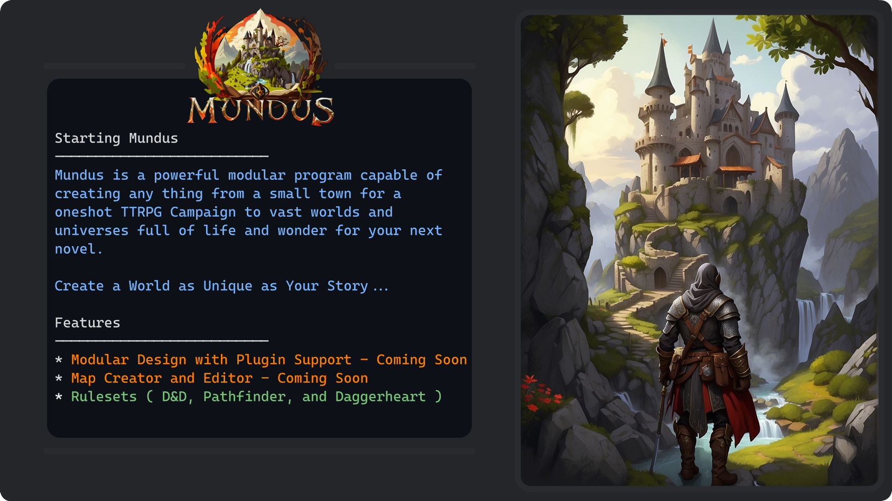

# Mundus - World Building App

Welcome to **Mundus**, the ultimate tool for creating and exploring immersive worlds. Whether you're a writer, game designer, or just someone who loves to dream up new universes, Mundus is designed to bring your visions to life.

## Features

- **Interactive World Map**: Create detailed maps with custom geography, cities, and landmarks.
- **Culture & Society Builder**: Develop unique cultures, societies, and political systems for your world.
- **Ecosystem Design**: Craft diverse ecosystems with a variety of flora and fauna.
- **History Timeline**: Chart the history of your world from its creation to the present day.
- **Character Creator**: Design characters that inhabit your world, complete with backstories and relationships.
- **Story Arc Tool**: Plan out major events and story arcs within your world.
- **Collaboration**: Work with others in real-time to build worlds together.
- **Export and Share**: Easily export your creations and share them with the Mundus community.

## Installation

### Prerequisites

Before installing Mundus, ensure that you have:

- A compatible device (Windows, Linux or MacOS).
- Internet connection (for initial download and updates).

### Steps

1. **Download**: Visit the [Mundus website](https://www.mundusapp.com) and choose the version compatible with your device.
2. **Install**: Run the downloaded file and follow the on-screen instructions to install.
4. **Update**: Ensure that you have the latest version for the best experience.

## Getting Started

- **Quick Start Guide**: Check out our Quick Start Guide to jump right into world building.
- **Tutorials**: Explore our tutorials for in-depth guidance on each feature.
- **Community Forum**: Join the Mundus community forum to get tips, share your worlds, and collaborate.

## Support

Having issues or need help? Contact our support team at support@mundusapp.com or visit our [Help Center](https://www.mundusapp.com/help).

## Contribution

Your feedback makes Mundus better. Share your ideas and suggestions on our [Feedback Page](https://www.mundusapp.com/feedback).

---

Embark on your world-building journey with Mundus and bring your imagination to life!
